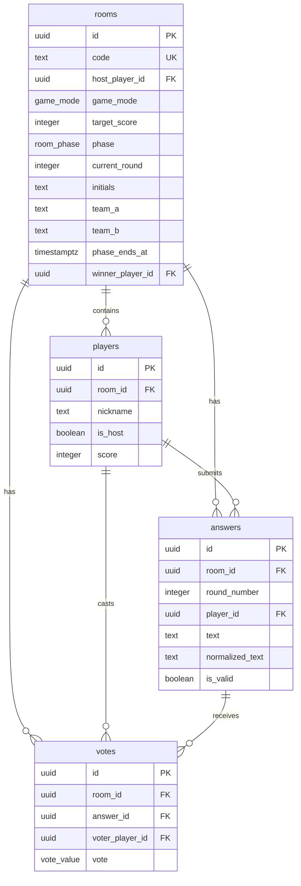
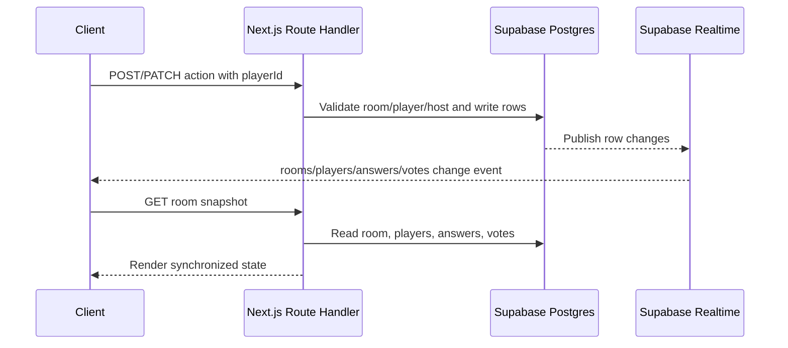

# Football Party Architecture

## Project Structure

```txt
app/
  api/rooms/                  Route handlers for room mutations and snapshots
  room/[code]/page.tsx        Dynamic room screen
  page.tsx                    Home create/join screen
components/
  home-page.tsx               Create and join room UI
  room-client.tsx             Lobby, game phases, voting, leaderboard
lib/
  server/room-service.ts      Supabase writes and game rules
  supabase/client.ts          Browser realtime client
  supabase/server.ts          Server Supabase client
  constants.ts                Target scores, initials, team database
  game-utils.ts               Normalization, timers, scoring helpers
  session-store.ts            Zustand persisted player session
  types.ts                    Shared TypeScript models
supabase/
  schema.sql                  Tables, constraints, RLS, realtime publication
```

## Database Schema



## Realtime Flow



## Implementation Plan

1. Create room and join room APIs with 6 character codes and persisted browser player sessions.
2. Build lobby UI with player list, host badge, game mode selection, and target score controls.
3. Add Supabase Realtime subscriptions for all room tables and snapshot refresh on changes.
4. Implement Footballer Initials Challenge phases: countdown, timed answer entry, reveal, voting, scoring, leaderboard, winner.
5. Implement Random Team Battle phases: countdown, synchronized team matchup, 20 second display, generate new matchup.
6. Keep all writes in route handlers so game-rule checks are centralized for the MVP.
